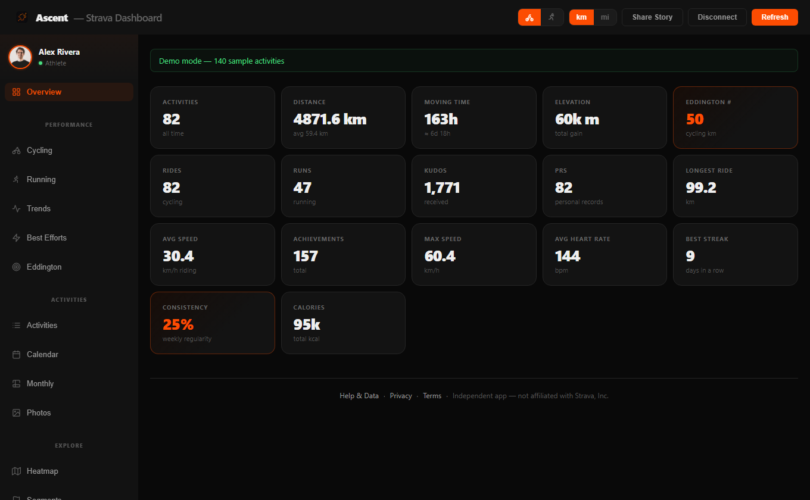
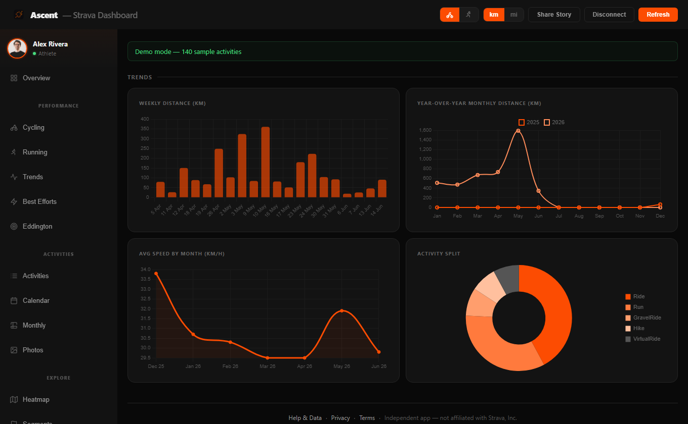
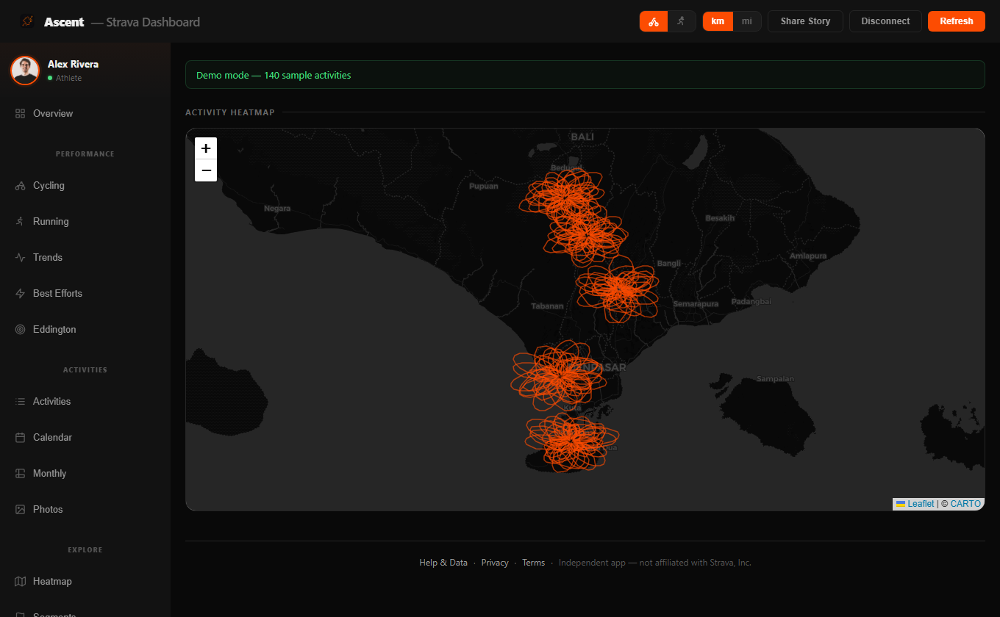
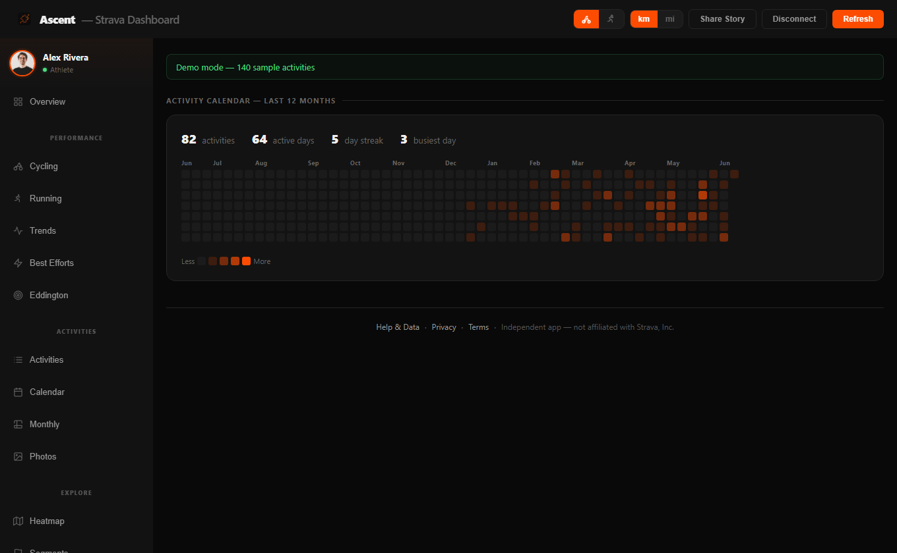
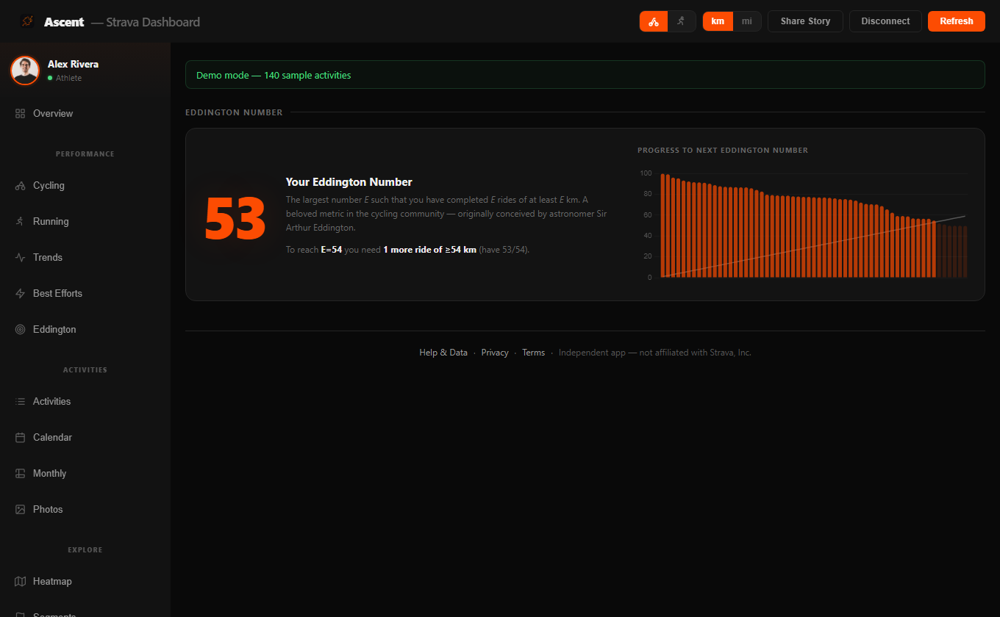
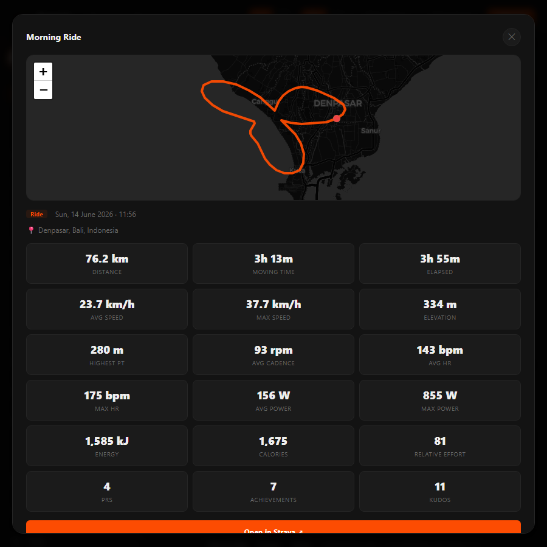
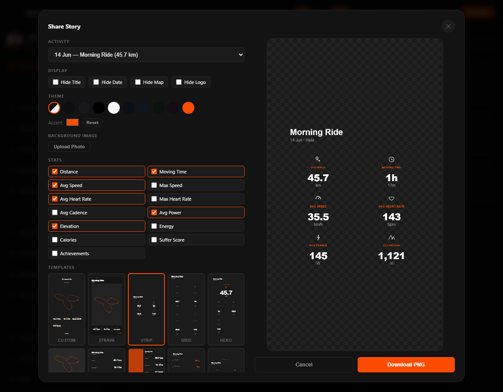
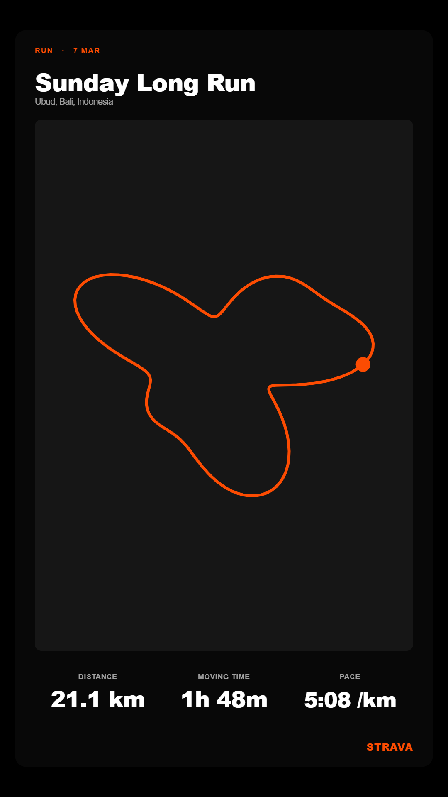
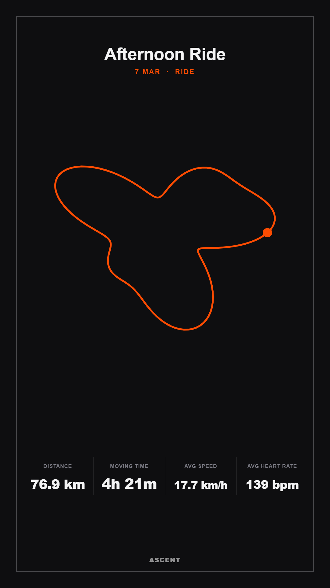

<p align="center">
  
</p>

<h1 align="center">Ascent — Strava Dashboard</h1>

A personal Strava activity dashboard with an Instagram/TikTok-style story card generator. Built as a static single-page app — no framework, no backend.

**Live demo:** https://ascent-analytics.vercel.app/



---

## Screenshots

> All screenshots use the built-in **demo mode** (sample data — no real account).

| Trends | Heatmap |
|---|---|
|  |  |

| Calendar | Eddington number |
|---|---|
|  |  |

| Activity detail | Story card generator |
|---|---|
|  |  |

**Story card layouts:**

| Strava | Pace | Map |
|---|---|---|
|  |  |  |

---

## Features

- Connect your Strava account via OAuth
- View stats: total distance, elevation, moving time, speed, heart rate, and more
- Activity list, bubble chart, Eddington number, weekly/monthly charts, calendar heatmap
- **Story card generator** — export your activity as a 1080×1920 PNG
  - 13+ layouts: Strip, Grid, Hero, Map, Minimal, Split, Stacked, Cinema, Neon, Sport, Gradient, Badge, Tiles, Ink, Neon 6
  - Transparent background support — paste directly over any photo
  - Custom color schemes + BG/accent/text color picker
  - Hide title / hide date toggles
  - Calories, power, cadence, heart rate, elevation and more as selectable stats
- Activity caching in your own browser — reduces Strava API calls (see [Data & Privacy](#data--privacy))
- PWA — installable on mobile as a home screen app
- Demo mode — works without a Strava account

---

## Data & Privacy

**This app does not collect, store, or send your data to any server we control.**

- **Everything runs in your browser.** Strava activity data is fetched directly
  from the Strava API by your browser and is never sent to a backend of ours.
- **Caching is local only.** Your activities are cached in your browser's
  `localStorage` (per athlete, 6-hour TTL) so the app doesn't re-fetch on every
  visit. Clearing your browser storage removes it.
- **No remote database.** The code includes an *optional* Supabase remote cache
  for cross-device syncing, but it is **disabled by default** (`_haveRemote = false`
  in `js/config.js`). As shipped, no copy of your activities is kept on any
  server — "everything runs in your browser" is literally true.
- **Login tokens** (Strava access/refresh tokens) are stored only in your
  browser's `localStorage`. Disconnecting clears them.
- **The only server-side code** is `api/strava-token.js`, a stateless function
  that exchanges/refreshes your Strava OAuth token. It keeps the Strava
  **client secret** server-side (so it never reaches the browser) and stores
  nothing — it just relays the request to Strava and returns the response.

If you re-enable the optional Supabase cache (see below), your activities would
then also be stored in *your own* Supabase project — read the privacy note in
that section before doing so.

---

## Getting Started

### 1. Create a Strava API app

1. Go to https://www.strava.com/settings/api
2. Create an application
3. Set **Authorization Callback Domain** to `localhost` for local dev (change to your domain for production)
4. Note your **Client ID** and **Client Secret**

### 2. Set up Supabase (optional — disabled by default)

> **Note:** the remote Supabase cache is **off** in this codebase
> (`_haveRemote = false` in `js/config.js`). The app works fully without it
> using the browser-local cache. Only follow this step if you want cross-device
> syncing — then set `_haveRemote` back to the env check to enable it.

1. Create a free project at https://supabase.com
2. Run this SQL in the Supabase SQL editor:

```sql
-- One row per athlete; `id` is the Strava athlete id (multi-user)
CREATE TABLE IF NOT EXISTS strava_cache (
  id          BIGINT PRIMARY KEY,
  activities  JSONB NOT NULL,
  synced_at   TIMESTAMPTZ DEFAULT NOW()
);
```

> **Privacy note:** the browser uses the public **anon key**, so by default any
> visitor could read any row. Each athlete's data is keyed by their Strava id,
> but to truly isolate users you should enable Row Level Security on
> `strava_cache`. Without a backend, full per-user isolation isn't possible from
> the anon key alone — the localStorage cache keeps each browser's data local
> regardless.

3. Note your **Project URL** and **anon/public key**

### 3. Local development

```bash
git clone https://github.com/doniwirawan/Ascent-Strava-Dashboard.git
cd Ascent-Strava-Dashboard

# Install dependencies
npm install

# Copy env file and fill in your values
cp .env.example .env.local

# Build (injects credentials into dist/)
node build.js

# Serve dist/ with any static server, e.g.:
npx serve dist
```

Open http://localhost:3000 and click **Connect with Strava**.

---

## Deploy to Vercel

[](https://vercel.com/new/clone?repository-url=https://github.com/doniwirawan/Ascent-Strava-Dashboard)

1. Fork or clone this repo and import it in the [Vercel dashboard](https://vercel.com/new)
2. Add environment variables in **Project Settings → Environment Variables**:

| Variable | Description |
|---|---|
| `STRAVA_CLIENT_ID` | From https://www.strava.com/settings/api |
| `STRAVA_CLIENT_SECRET` | From https://www.strava.com/settings/api |
| `SUPABASE_URL` | Your Supabase project URL *(optional)* |
| `SUPABASE_ANON_KEY` | Your Supabase anon/public key *(optional)* |

3. Update your Strava app's **Authorization Callback Domain** to your Vercel domain (e.g. `yourdomain.vercel.app`)
4. Vercel will automatically run `npm install && node build.js` on each deploy

---

## Project Structure

```
Ascent-Strava-Dashboard/
├── index.html       # Main app — all JS is inline
├── callback.html    # OAuth callback page
├── build.js         # Injects env vars into dist/ at build time
├── manifest.json    # PWA manifest
├── sw.js            # Service worker (offline cache)
├── icon.png         # App icon
├── vercel.json      # Vercel config
├── package.json
├── .env.example     # Copy to .env.local and fill in values
└── dist/            # Build output (generated, not committed)
```

---

## Tech Stack

- Vanilla HTML / CSS / JavaScript (no framework)
- [Chart.js](https://www.chartjs.org/) — charts
- [Supabase JS](https://supabase.com/docs/reference/javascript) — optional caching
- [Strava API](https://developers.strava.com/docs/reference/) — activity data
- [Vercel](https://vercel.com) — hosting + build pipeline

---

## License

**Personal, non-commercial use only.** You're welcome to clone this repo and run
your own copy for your own personal use, and to learn from or modify the code.

You may **not**:

- sell it, or use it (in whole or in part) in any commercial or paid product or service;
- run it as a hosted/production service offered to others;
- use it to build or operate anything that competes with the Ascent dashboard
  (https://ascent-analytics.vercel.app/).

See [LICENSE](LICENSE) for the full terms. Not affiliated with Strava, Inc.
